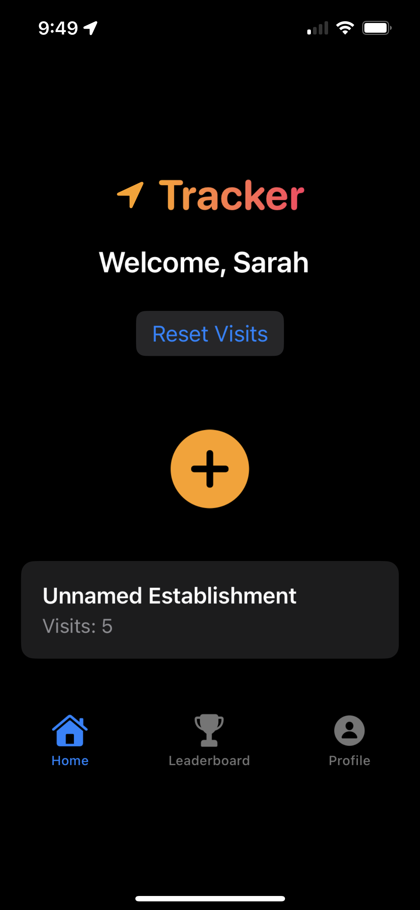
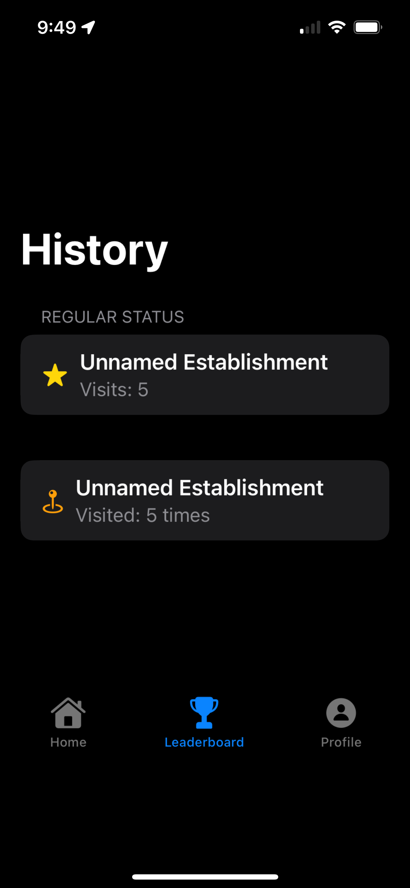
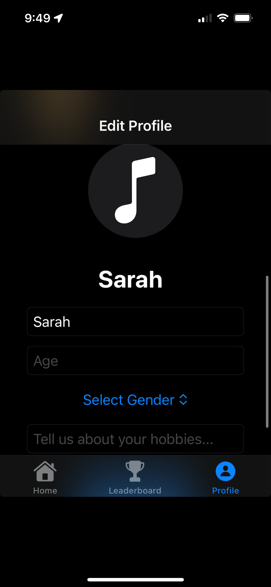
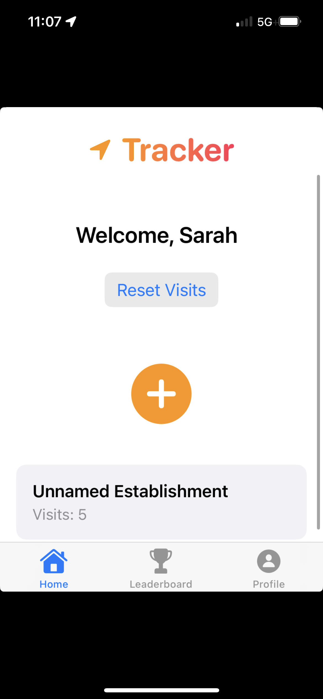
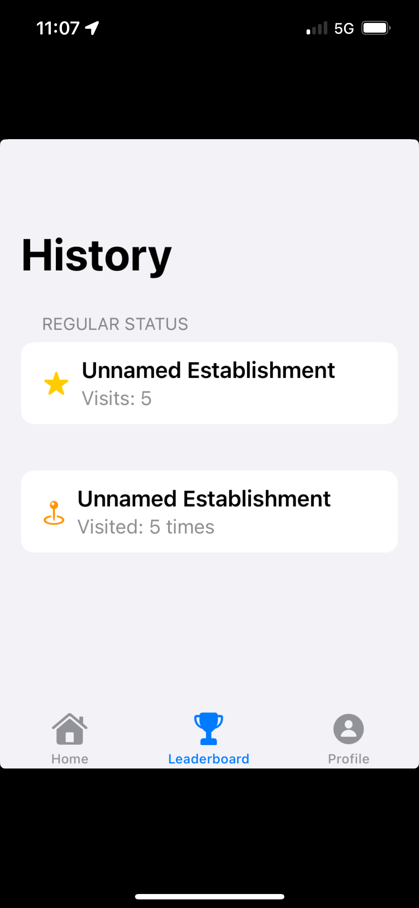
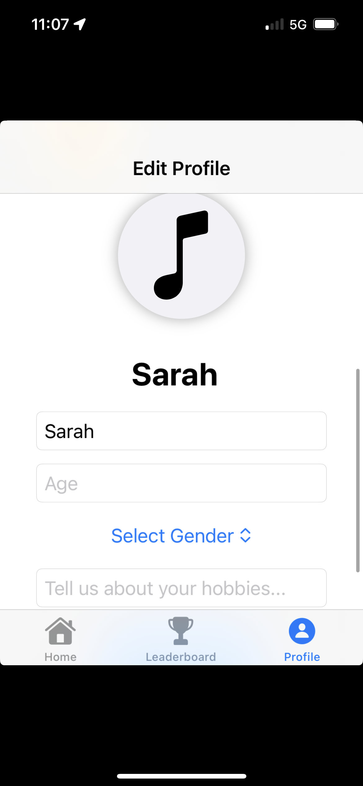

# ThirdPlacesApp
Third Places - iOS App

Description

Third Places is an iOS app that tracks and helps use rs revisit locations they frequent. The app leverages Core Location for location tracking, Firebase for cloud data synchronization, and push notifications to keep users engaged. The app tracks users' visits to their favorite places and sends notifications when they become a "regular" at a location (after visiting it multiple times) 

With a simple, user-friendly interface, Third Places helps users discover and re-engage with the places they visit often, whether for work, leisure, or daily routines!

Key Features

Core Location: Tracks the user's location and updates their visited places.
Push Notifications: Alerts users when they become a regular at a location.
Firebase Integration: Syncs location data across devices and stores user history in the cloud.
Technologies Used

Swift for app development
Core Location for location tracking
Firebase for cloud data storage and user authentication
UserNotifications for push notifications
Screenshots

Here are some screenshots of the most important screens of the app:

# Screenshots

   

   

   

   

   

   

Installation & Setup

To run this app locally, follow these steps:

1. Clone the Repository
Clone the repository to your local machine using the following command:

git clone https://github.com/smhallman10/ThirdPlaces.git
2. Install Dependencies
Make sure you have CocoaPods installed to manage dependencies. Run:

pod install
3. Open the Project
Open the .xcworkspace file in Xcode:

open ThirdPlaces.xcworkspace
4. Run the App
Run the app in Xcode’s simulator or on a real device to see the app in action!

Contributing

Contributions are welcome! If you have any suggestions or improvements, feel free to open an issue or submit a pull request.

License

This project is licensed under the MIT License - see the LICENSE file for details.
